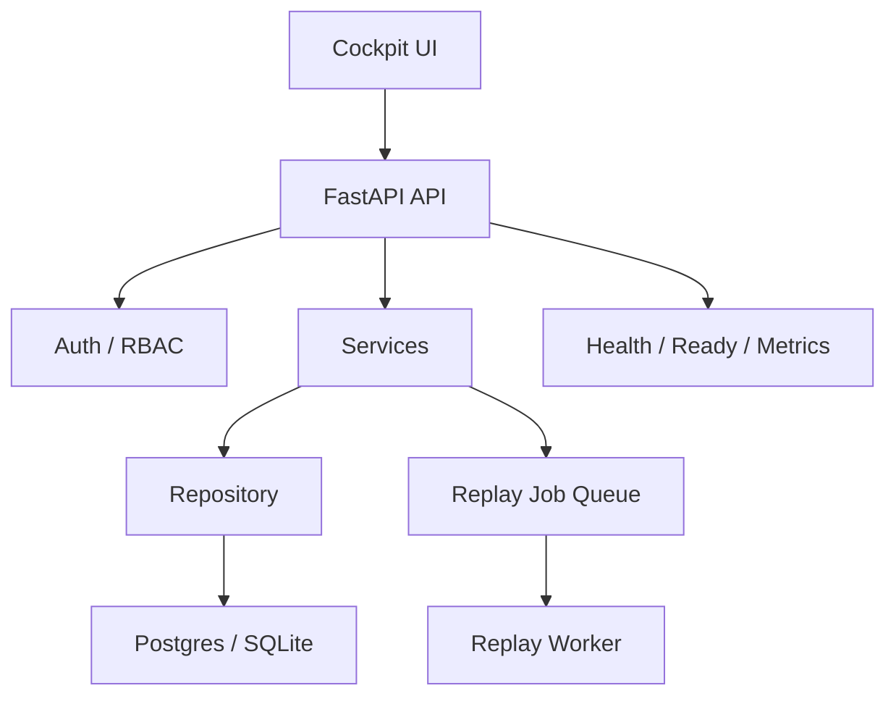

# Architecture

Agent Control Plane is now split into production-oriented layers:

- `repository.py`
  stores persistent runtime state through SQLAlchemy for scenarios, runs, steps, incidents, replays, activity, replay jobs, audit events, and operator notes
- `services.py`
  exposes operational logic, command-view metrics, compare views, markdown exports, and replay job orchestration
- `main.py`
  exposes the FastAPI API, request tracing, RBAC-guarded actions, health probes, and the cockpit UI
- `auth.py`
  resolves operator profiles, demo JWT auth, tenant scope, and permissions for approvals, incidents, and replay actions
- `worker.py`
  runs replay jobs outside the FastAPI process to keep execution separate from the HTTP lifecycle
- `metrics.py`
  exposes Prometheus-style counters and queue depth signals for ops visibility
- `static/`
  contains the browser cockpit and replay job polling flow

## Main Flow

1. A run exists or is launched from a scenario.
2. The operator inspects timeline, policy verdicts, boundaries, and eval signals.
3. The operator can approve, reject, escalate, contain, or replay the run.
4. Replay is queued as a background job and completed into a safer sibling run with a stricter bundle.
5. Compare view shows drift in risk, latency, cost, and control outcomes.

## Current product surfaces

- command cockpit
- execution timeline
- trace graph
- review queue
- ownership summary
- comparison matrix
- replay compare
- replay job status
- audit trail
- operator notes
- admin policy and tenant surfaces
- markdown exports for run and incident review
- health, readiness, and metrics probes

## Why the architecture is shaped this way

The goal is to keep the system easy to evolve:

- persistence is isolated behind repository boundaries
- operator logic stays in `services.py`
- HTTP surface stays thin in `main.py`
- auth and role checks stay separate from business logic
- the cockpit only consumes the same API that external automation could consume later

## Architecture decisions

### 1. API-first operator product

The cockpit is intentionally thin relative to the API. The product surface is an operator workstation, but the real contract is the HTTP API. That keeps future integrations open for automation, background processing, or alternate frontends.

### 2. Repository boundary before "real scale"

This codebase is not pretending to be a distributed platform already, but it does isolate persistence behind a repository layer early. That is the cheapest way to keep runtime logic from collapsing into handlers and to make future Postgres-first evolution cleaner.

### 3. Replay as a worker concern

Replay is the first operation that becomes operationally suspect under load. Moving it into a worker process is a small but meaningful production choice: request handlers stay responsive, job state becomes inspectable, and failure handling can evolve independently.

### 4. RBAC and tenant scope as first-class concepts

Most AI demos flatten permissions away. This project does the opposite because governance only becomes interesting when different operators can see, approve, or escalate different things.

### 5. Exportable artifacts over UI-only state

Run reports and incident bundles are Markdown exports because operational review rarely stays inside one browser session. This choice makes handoff, async review, and audit narratives much stronger than ephemeral UI state.

## Simple diagram

## Production slice already added

- SQLAlchemy-backed persistence
- role-aware auth through operator profiles
- demo JWT auth and tenant-aware API access
- background replay jobs
- separate replay worker process
- request IDs and structured request logs
- Prometheus-style metrics surface
- Alembic migration scaffolding
- Docker/dev runbook assets

## Next meaningful upgrades

- Postgres-first docker profile and migration tooling
- external event ingestion
- dedicated worker process for jobs
- OpenTelemetry traces and richer metrics
